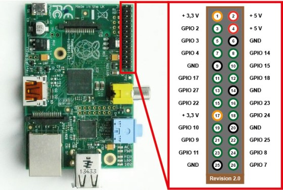

# Notes installation / configuration version 3 "Paco"
## Aspect matériel
Sur le plan matériel, ce qu'on trouve [dans le README principal](../README.md) est toujours d'actualité en terme de choix, les branchements / configurations seront précisés plus bas.

## Aspect logiciel
Le système d'exploitation utilise une distribution allégée construite avec buildroot selon [la configuration suivante](https://github.com/symac/buildroot_jukidbox) pour charger les modules nécessaires et ceux-là seulement.

# Branchements
La version validée a été réalisée sur un RPi 1B avec 26 pins sur le schéma suivant : 


## Boutons
Les boutons sont branchés à l'aide d'un cable de masse qui rejoint l'ensemble des masses des boutons et est fixé au pin 25 / GND; L'autre point de connexion des boutons est rélié dans la configuration par défaut à :

- Album suivant = pin 5 / GPIO 3
- Album précédent : pin 10 / GPIO 15
- Chanson suivante : pin 8 / GPIO 14
- Chanson précédente : pin 3 / GPIO 2

## Slider
Le potentiomètre utilise un chipset MCP3008 pour faire le lien avec le RPi. Le schéma utilisé pour faire le branchement est celui disponible sur http://nagashur.com/blog/2013/01/13/lire-des-entrees-analogiques-sur-un-raspberry-avec-un-circuit-adc-le-mcp3008/ ([internet Archive](https://web.archive.org/web/20201214045109/http://nagashur.com/blog/2013/01/13/lire-des-entrees-analogiques-sur-un-raspberry-avec-un-circuit-adc-le-mcp3008/)).

## Ampli audio
L'ampli audio n'a pas besoin de lien direct avec le RPi, il suffit simplement d'avoir accès à une paire 5V/GND, il en reste de disponible sur le RPi après avoir branché boutons + slider.

# Fichier de configuration
Les pins décrits ci-dessus sont définis dans le fichier [jukidbox.ini](../jukidbox.ini). La version de base de ce fichier est stockée sur le système dans ```/root/jukidbox/jukidbox.ini```. Si l'on souhaite remplacer ce fichier, on peut en déposer une copie modifiée au choix :

- à la racine de la clé USB;
- sur le système d'exploitation ```/home/rpi/jukidbox.ini```

En dehors des PIN, il est aussi possible de définir dans ce fichier le volume maximale du son qui peut être atteint par le potentiomètre. Par défaut, celui-ci est fixé à 85%.